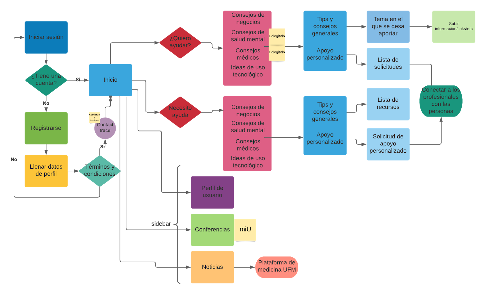
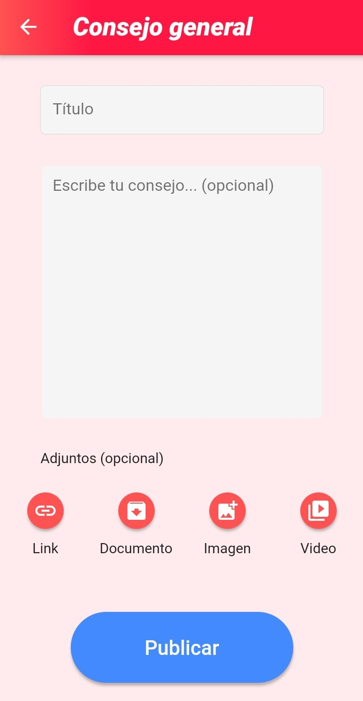
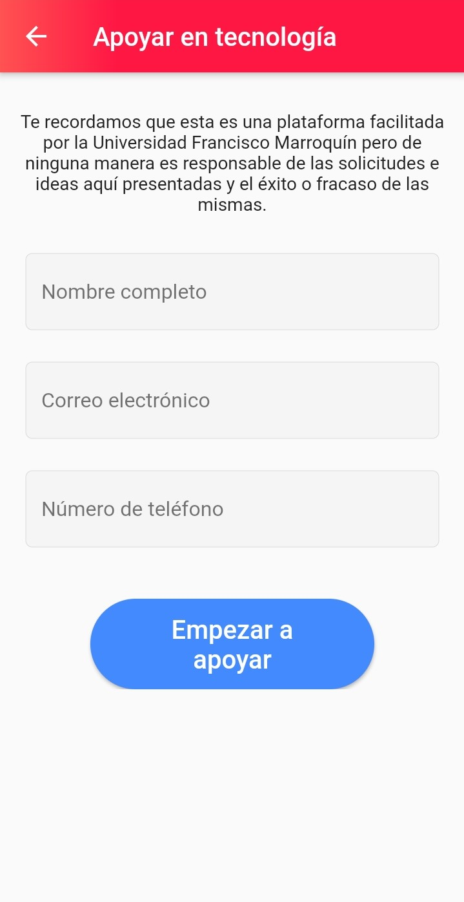
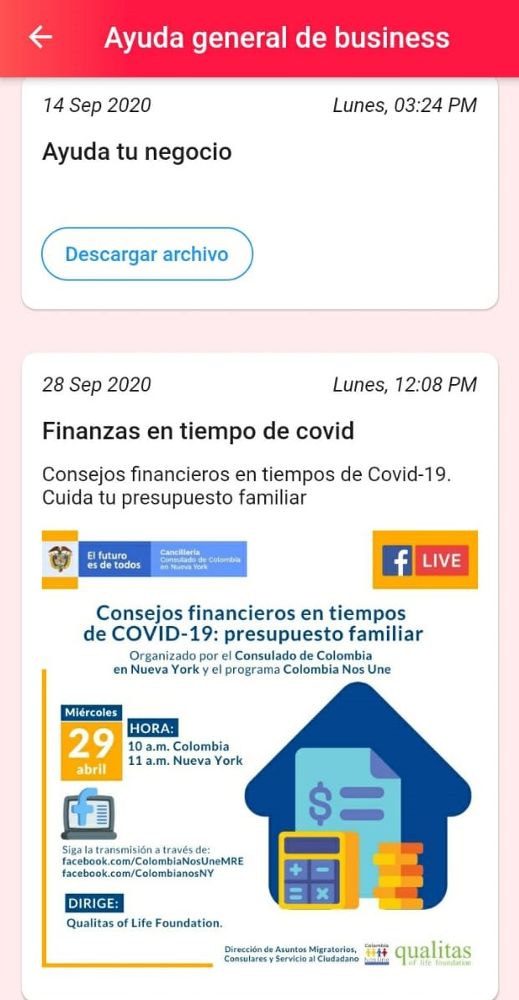
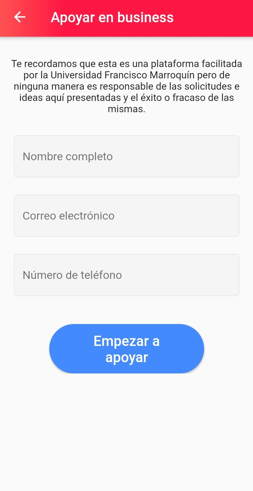
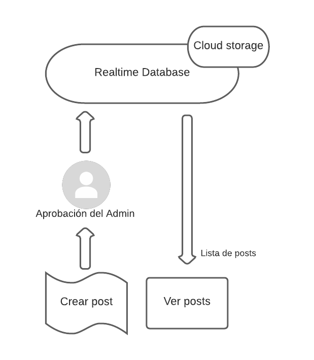
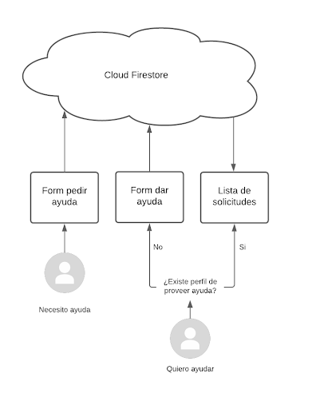
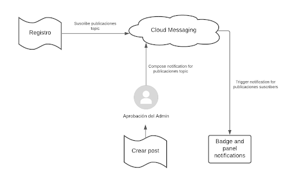

# Covid relief app

## Table of Contents

* [About the Project](#about-the-project)
  * [Built With](#built-with)
* [Getting Started](#getting-started)
  * [Prerequisites](#prerequisites)
* [Usage](#usage)
* [Roadmap](#roadmap)
* [Architecture](#architecture)
  * [CQRS](#cqrs)
  * [Bounded Contexts](#bounded-contexts)
  * [Design](#design)

## About the Project

This app will centralize information and general advice, matching people who can help and those who need that help

### Built with

* Flutter
* Firebase

## Getting Started

### Prerrequisites

[Install flutter](https://flutter.dev/docs/get-started/install)

## Usage

1. Clone the repo

```sh

git clone https://github.com/Covid-relief/Covid-relief-app.git

```

2. Run the project

```sh

flutter run

```

## Roadmap



## Architecture

### CQRS

Command query responsibility segregation (CQRS) uses separate Query and Command objects to retrieve and modify data, respectively

#### Event sourcing

This app storages a sequence of events; state changes are triggered to update the state of the application in response to these events

#### Event driven architecture

Commands are invoked every time something needs to change. The command services are also responsible for validating the business rules and saving the results as events

#### Write/read separation

A command changes the state of an aggregate but does not return any data; a query returns data but does not alter the state of an aggregate

### Bounded Contexts

### Give help

#### General



#### Personalized



### Receive help

#### General



#### Personalized



### Websites

This appears in the home screen as a button that send you to the website of UFM med school

### Webpage (admin)


### Independent app (contact tracing)

This is an additional app used to prevent the spread of COVID-19. In general, it involves identifying people who became infected (by reporting themselves) and people who came in contact with them and working with them to interrupt disease spread

### Design

Basically we worked leaving bounded contexts separately (as well as read queries and write commands)

#### General help



When a post is being created, if it contains any type of file (image, video or document) it connects to cloud storage to manage it and store it there. When the post is created, it triggers an event to the system and it appears in the admin panel to approve it



When a request of help is submitted, if someone wants to have access they need to have already applied to a "give help request". If this request is already filled, the person can see the panel of requests and choose which one they want to attend, and if the help will be using Mail or WhatsApp



When someone logs in it triggers an event of suscriber to "publicaciones" topic. Once an admin approves a post it triggers an event to "publicaciones" suscribers; this suscribers receive a notification to check the new post in the app
